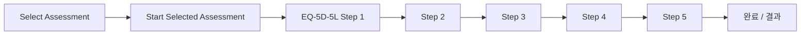

# ref 이미지 기반 화면 개발 계획

## 1. ref 이미지 요약

| 이미지                                                | 화면                           | 핵심 요소                                                                                                       |
| -------------------------------------------------- | ---------------------------- | ----------------------------------------------------------------------------------------------------------- |
| [select_assessment.png](../ref/select_assessment.png) | 평가 선택                        | 제목/안내문, 사용자 카드(홍건등, 생년월일·성별·ID), 평가 카드 2종(EQ-5D-5L 선택됨, EQ-VAS 미선택), 하단 CTA "Start Selected Assessment (N)" |
| [EQ-5D-5L_mobility.png](../ref/EQ-5D-5L_mobility.png) | EQ-5D-5L Step 1/5 (Mobility) | 뒤로가기, 제목 "EQ-5D-5L", Step 1 of 5 진행바, 안내문, "Mobility" 섹션, 5개 라디오 옵션, "Next" 버튼                              |

EQ-5D-5L은 5개 차원(Mobility, Self-care, Usual activities, Pain/discomfort, Anxiety/depression) × 5단계 응답으로 구성되는 표준 건강 관련 QoL 설문이다. ref는 1차원(Mobility)만 보여주며, 동일 패턴으로 5단계를 반복하는 플로우로 설계한다.

---

## 2. 화면 플로우

- **Select Assessment**: 선택한 평가만 시작(예: EQ-5D-5L 1개 선택 시 "Start Selected Assessment (1)").
- **EQ-5D-5L**: Step 1~5 각각 한 차원, 5개 라디오 옵션; Next로 다음 단계, 마지막 단계에서만 "완료" 등으로 전환(구체 문구는 설계 시 확정).

---

## 3. 구조 및 레이아웃

### 3.1 공통 레이아웃 (대시보드 계열 아님, 모바일 친화 단일 컬럼)

- **Header**: 뒤로가기(선택), 중앙 제목, 필요 시 서브 텍스트(예: Step 1 of 5).
- **Content**: 스크롤 가능 본문(안내문, 섹션 제목, 카드/라디오 리스트).
- **Footer**: 고정 CTA 버튼 1개(예: Next, Start Selected Assessment).

레이아웃 컴포넌트는 `features/` 또는 `shared/`에서 **SingleColumnLayout** 형태로 한 번만 정의하고, 두 화면에서 재사용한다. (SKILL: 반복 패턴 공통화)

### 3.2 화면별 영역 분해

**Select Assessment**

- 상단: 제목 "Select Assessment", 안내 문단.
- 사용자 카드 1개: 아바타(placeholder 가능), 이름, "Mar 12, 1990 • Male | ID: AID-20394" 형식 — 데이터는 모델/상수에서 주입.
- 안내 문단 1줄.
- 평가 카드 리스트: 카드 N개(EQ-5D-5L, EQ-VAS 등). 각 카드: 아이콘, 제목, 선택 시 체크, 설명(키워드 강조), 소요시간.
- 하단: "Start Selected Assessment (N)" 버튼, N은 선택 개수.

**EQ-5D-5L (각 Step)**

- Header: 뒤로가기, "EQ-5D-5L", 진행 표시(Step X of 5).
- Content: 공통 안내문 1줄 + 현재 차원 제목(예: Mobility) + 5개 라디오.
- Footer: "Next" (Step 5에서는 "완료" 등).

---

## 4. 책임 단위별 분해 (모듈 / 컴포넌트 / 훅)

### 4.1 도메인 & 데이터 (domains, 데이터 파일 분리)

- **domains/assessment/**
  - **types.ts**: `Assessment`, `AssessmentId`, `UserInfo`, `Eq5d5lDimension`, `Eq5d5lLevel` 등 타입만 정의. (SKILL: Model은 type 단위로 명확히 분리)
  - **constants.ts**: 차원 아이디·라벨 매핑(예: mobility, selfCare, ...), 레벨 1~5 라벨. (SKILL: 상수는 의미별 개별 파일)
- **데이터 파일 (UI/로직과 분리)**
  - **data/assessments.ts** 또는 **data/mockUser.ts**: 목록 데이터, 사용자 목업. 컴포넌트/훅 내부 하드코딩 금지. (SKILL: Mock 데이터는 별도 파일, 실데이터/목업 교체 가능 인터페이스)

추후 API 연동 시 `@tanstack/react-query` 사용, 동일 인터페이스로 스왑. (SKILL: 외부 데이터는 react-query)

### 4.2 Primitives 추가 (shared/ui/primitives)

- **RadioGroup**: Radix `@radix-ui/react-radio-group` 래퍼. 라디오 목록 + 선택값, a11y 유지. (SKILL: Radix 직접 사용 금지, wrapper만 사용)
- **Card (선택)**: 평가 카드·사용자 카드에 쓸 수 있는 래퍼. 배경/radius/패딩은 테마 토큰만 사용. 기존 Button/Dialog와 동일 원칙.

버튼은 기존 [Button](src/shared/ui/primitives/Button/index.tsx) 재사용. 필요 시 variant 확장(예: fullWidth).

### 4.3 Features (기능 단위)

- **features/select-assessment/**
  - **SelectAssessmentScreen.tsx**: 레이아웃 + 제목/안내 + 사용자 카드 + 평가 카드 리스트 + CTA. **선택 상태·유효성 등 비즈니스 로직은 훅으로 분리.**
  - **useSelectAssessment.ts**: 선택된 assessment ID 목록, 토글 선택, "Start" 시 선택된 항목 반환. (SKILL: 비즈니스 로직은 Custom Hook)
  - **AssessmentCard.tsx**: 단일 평가 카드(선택 여부, 제목, 설명, 소요시간). 클릭 시 선택 토글.
- **features/eq5d5l/**
  - **Eq5d5lStepScreen.tsx**: 한 스텝만 담당. Header(뒤로, 제목, Step X of 5) + 안내 + 차원 제목 + RadioGroup(5개) + Next. **현재 차원/선택값은 훅에서 주입.**
  - **useEq5d5lStep.ts**: 현재 step index, 선택된 레벨, Next 시 저장 및 다음 step 이동 여부. (선택값 저장 구조는 도메인 타입과 맞춤)
  - **Eq5d5lProgress.tsx**: Step 1 of 5 텍스트 + 진행 바(시각만, 토큰 기반).

컴포넌트는 "의미적으로 읽히는" JSX 위주, 조건/가공은 훅·유틸로 최소화. (SKILL: 컴포넌트는 UI 표현만)

### 4.4 App 라우팅 & 진입

- **app/routes** (또는 app 내):
  - `/` 또는 `/assessment` → Select Assessment
  - `/assessment/eq5d5l` → EQ-5D-5L Step 1;
  - `/assessment/eq5d5l/step/:stepIndex` 또는 쿼리/상태로 step 구분.
- **공통 레이아웃**: Header/Content/Footer를 묶는 **ScreenLayout** (또는 SingleColumnLayout)을 app 또는 shared에 두고, 두 화면에서 사용.

---

## 5. Design System / 스타일 준수

- **색상·spacing·radius·typography**: [theme.css](../src/shared/styles/theme.css) 토큰만 사용. 하드코딩 금지. (SKILL: CSS Variables, 테마 토큰)
- **선택 상태(파란 배경, 체크 아이콘)**: `--color-primary`, `--color-surface` 등 기존 토큰으로 표현. 필요 시 `--color-primary-muted` 등 토큰만 theme.css에 추가.
- **타이포**: 제목/본문/캡션은 모두 테마 typography 토큰. (SKILL: Typography 규칙)
- **모션**: 필요 시(예: 진행 바 채우기) 토큰 또는 공통 유틸로 제어. 장식 목적 과도 애니메이션 금지. (SKILL: Motion 규칙)

---

## 6. 테스트 및 품질 (SKILL 준수)

- **Unit**: `useSelectAssessment`, `useEq5d5lStep` 및 순수 유틸/도메인 함수.
- **Integration**: SelectAssessmentScreen(선택 토글, CTA 클릭), Eq5d5lStepScreen(라디오 선택, Next).
- **E2E**: "평가 선택 → Start → Step 1 라디오 선택 → Next → Step 2 노출" 등 핵심 플로우 1~2개.
- **Storybook**: AssessmentCard, Eq5d5lProgress, RadioGroup(primitive), SelectAssessmentScreen, Eq5d5lStepScreen. (SKILL: 개발된 컴포넌트는 Storybook에 추가)

프로젝트에 Storybook이 아직 없으면 설정 추가 후 위 컴포넌트 스토리 작성.

---

## 7. 구현 순서 제안

1. **docs/** 에 본 계획서 저장 (예: `docs/plan-ref-screens.md`). (SKILL: 계획은 docs/에 저장)
2. 도메인 타입·상수·목업 데이터 파일 추가.
3. Primitives: RadioGroup, (필요 시) Card. 테마 토큰만 사용.
4. 공통 레이아웃(ScreenLayout) 및 테마 토큰 보강(필요 시).
5. features/select-assessment 구현 (훅 → 화면).
6. features/eq5d5l 구현 (훅 → 스텝 화면).
7. app 라우팅 연결 및 진입점 수정.
8. Unit / Integration / E2E 테스트 작성 및 Storybook 스토리 추가.
9. 검증 요약 및 docs 업데이트.

---

## 8. 산출물 정리

| 산출물        | 위치/내용                                                         |
| ---------- | ------------------------------------------------------------- |
| 계획서        | [docs/plan-ref-screens.md](plan-ref-screens.md) (저장할 파일) |
| 도메인 타입/상수  | domains/assessment/types.ts, constants.ts                     |
| 목업 데이터     | data/ 또는 domains/assessment/data/                             |
| Primitives | shared/ui/primitives/RadioGroup, (Card)                       |
| 공통 레이아웃    | app 또는 shared/layout                                          |
| 기능         | features/select-assessment, features/eq5d5l                   |
| 라우팅        | app (react-router 등)                                          |
| 테스트        | 각 모듈별 *.test.tsx, e2e/*.spec.ts                               |
| Storybook  | *.stories.tsx (설정 포함)                                         |

이 계획은 사용자 컨펌 후 구현 단계로 진행한다. (SKILL: 사용자 컨펌 이후에만 구현 진행)

---

## 9. Phase 0: 사전 결정 및 계약

### 라우팅 (react-router-dom)

| 경로 | 화면 |
|------|------|
| `/` | Select Assessment |
| `/assessment/eq5d5l` | EQ-5D-5L Step 1 |
| `/assessment/eq5d5l/step/:stepIndex` | EQ-5D-5L Step 2~5 (stepIndex 1~4) |
| `/assessment/eq5d5l/complete` | EQ-5D-5L 완료 화면 |

### Storybook

- 사용: 예. 포트 **44012** (44010~44020 정책 준수).
- README에 포트 명시.

### 데이터 계약 (목업/API 교체 가능)

- **타입**: `Assessment`, `AssessmentId`, `UserInfo`, `Eq5d5lDimension`, `Eq5d5lLevel`, `Eq5d5lAnswers`
- **인터페이스**: `getAssessments(): Promise<Assessment[]>`, `getCurrentUser(): Promise<UserInfo>` — 추후 react-query/API로 교체 시 동일 시그니처 유지.
